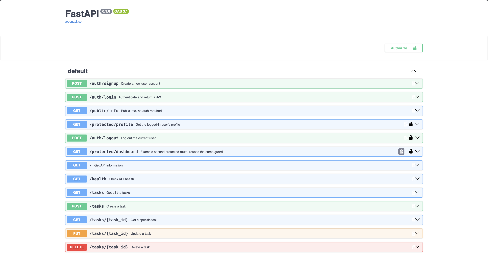
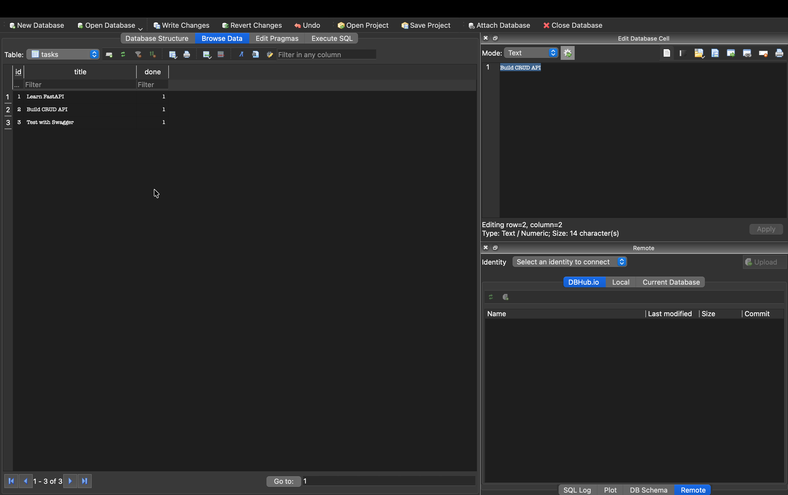
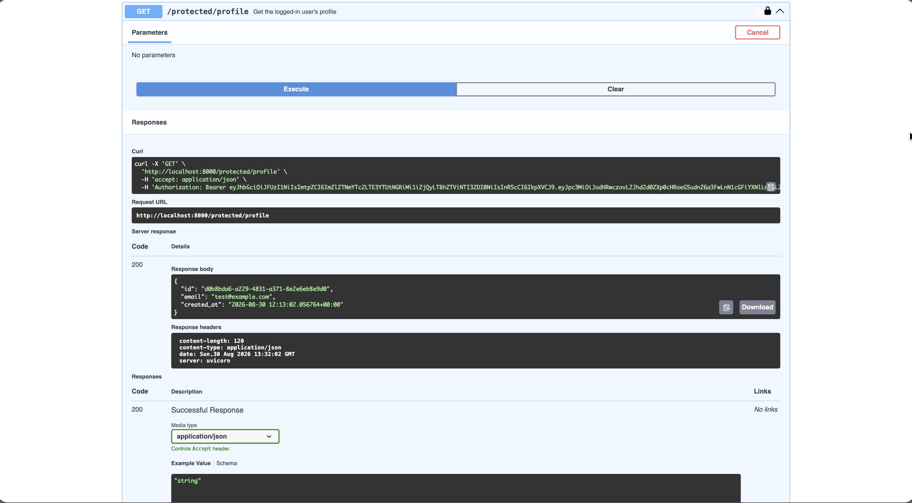

# Task API - with Auth

A CRUD API for managing a to-do list, secured with Supabase Auth (sign up, log in, log out, protected routes), built with Python and FastAPI. FlyRank Backend Track - Assignments A1, A2, A4.

## Setup

### 1. Create a Supabase project

Create a free Supabase project at https://supabase.com/ and copy your **Project URL** and **anon key** from **Project Settings → API**.

### 2. Set up environment variables

Copy `.env.example` to `.env` and fill in your real values:

    cp .env.example .env

### 3. Disable email confirmation for testing

In your Supabase Dashboard, go to **Authentication → Sign In / Providers → Email** and turn off **Confirm email** for testing only.

## How to Run

### 1. Create a virtual environment

    python3 -m venv venv

### 2. Activate the virtual environment

    source venv/bin/activate

### 3. Install dependencies

    pip install fastapi uvicorn python-dotenv supabase

### 4. Start the server

    uvicorn main:app --reload

The API will run at:

http://localhost:8000

Swagger UI is available at:

http://localhost:8000/docs

## API Reference

| Method | Endpoint | Description | Auth Required |
|---|---|---|---|
| POST | `/auth/signup` | Create a new user account | No |
| POST | `/auth/login` | Authenticate and return a JWT | No |
| POST | `/auth/logout` | End the user's session | Yes (Bearer) |
| GET | `/public/info` | Public, open data | No |
| GET | `/protected/profile` | Read the logged-in user's profile | Yes (Bearer) |
| GET | `/protected/dashboard` | Second example protected route | Yes (Bearer) |
| GET | `/tasks` | Get all tasks | No |
| GET | `/tasks/{task_id}` | Get a specific task | No |
| POST | `/tasks` | Create a task | No |
| PUT | `/tasks/{task_id}` | Update a task | No |
| DELETE | `/tasks/{task_id}` | Delete a task | No |

## Auth Flow

1. `POST /auth/signup` with `{"email": "...", "password": "..."}` → `201`

2. `POST /auth/login` with the same body → `200`, returns `access_token` and `refresh_token`

3. Send the access token as `Authorization: Bearer <token>` to any `/protected/*` route or `/auth/logout`

4. An invalid, tampered, or expired token → `401` with `{"error": "..."}`

## Swagger UI

## SQLite Database

SQLite was chosen because it is a single file, requires zero setup, and survives restarts.

The database is stored in `tasks.db`. It is created automatically and is git-ignored so each clone starts fresh.

The project uses Python's built-in `sqlite3` library, so no additional SQLite package is required.

## SQLite Query Example

The query `UPDATE tasks SET done = 1;` returned:

> Execution finished without errors.
>
> Result: query executed successfully. Took 0ms, 3 rows affected
>
> At line 1:
>
> `UPDATE tasks SET done = 1;`

## Database Screenshot

## Swagger Screenshot after Authorization

## How to Start the App

    uvicorn main:app --reload
