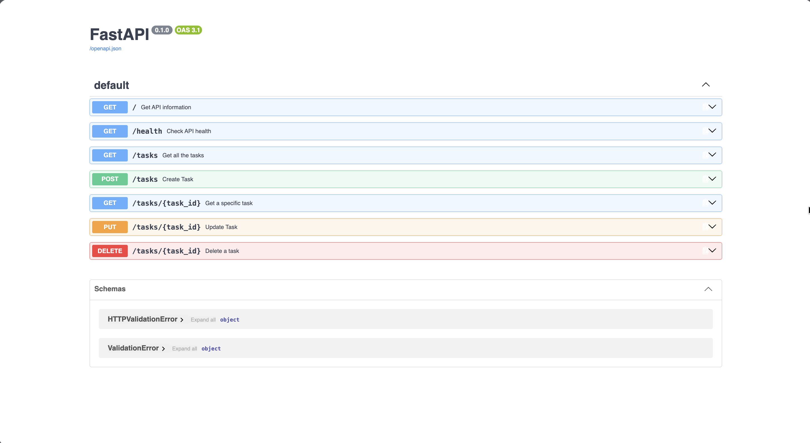

# Task API

A small CRUD API that manages a to-do list, built with Python and FastAPI as part of the FlyRank Backend Track Week 2 assignment.

## How to Run

### 1. Create a virtual environment

    python3 -m venv venv

### 2. Activate the virtual environment

    source venv/bin/activate

### 3. Install dependencies

    pip install fastapi uvicorn

### 4. Start the server

    uvicorn main:app --reload

The API will run at:

http://localhost:8000

Swagger UI is available at:

http://localhost:8000/docs

## Endpoints

| Method | Endpoint | Description |
|---|---|---|
| GET | `/` | Get API information |
| GET | `/health` | Check API health |
| GET | `/tasks` | Get all tasks |
| GET | `/tasks/{task_id}` | Get a specific task |
| POST | `/tasks` | Create a new task |
| PUT | `/tasks/{task_id}` | Update a task |
| DELETE | `/tasks/{task_id}` | Delete a task |

## Example curl Output

    curl -i http://localhost:8000/tasks/1

    HTTP/1.1 200 OK
    date: Wed, 26 Aug 2026 07:53:38 GMT
    server: uvicorn
    content-length: 44
    content-type: application/json

    {"id":1,"title":"Read the doc","done":false}

## Swagger UI

# flyrank_fastapi_crud_w3_a2

## SQLite Database

SQLite was chosen because it is a single file, requires zero setup, and survives restarts.

The database is stored in `tasks.db`. It is created automatically and is git-ignored so each clone starts fresh.

The project uses Python's built-in `sqlite3` library, so no additional SQLite package is required.

## SQLite Query Example

The query `UPDATE tasks SET done = 1;` returned 
"Execution finished without errors.
Result: query executed successfully. Took 0ms, 3 rows affected
At line 1:
UPDATE tasks SET done = 1;"

## Database Screenshot

## How to start the app
uvicorn main:app --reload